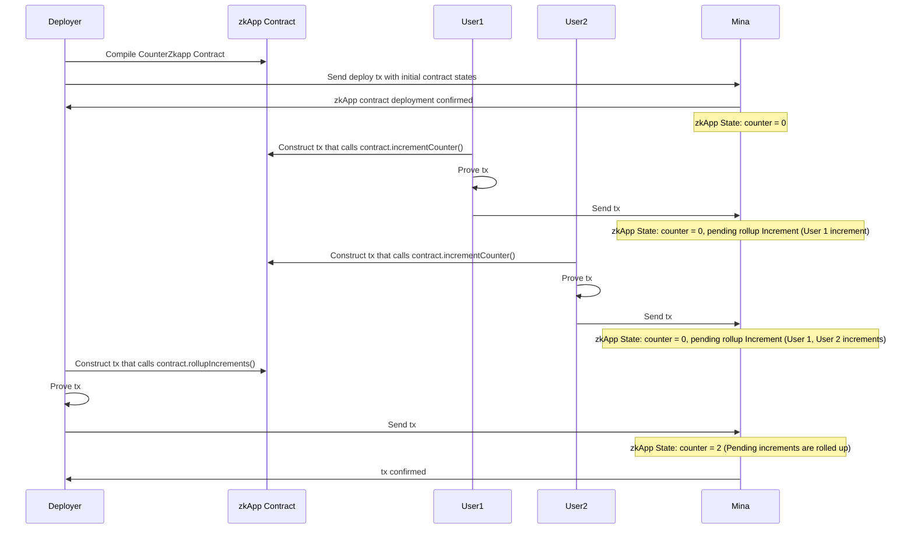

# Mina zkApp: Counter Zkapp Contract With Reducers

This project showcases the core utilization of zkApps in Mina Protocol by implementing a straightforward smart contract named CounterZkapp. The CounterZkapp contract maintains a state variable counter, which is a field initialized to 0 by default when the contract is deployed. On invoking the incrementCounter method, it increments the counter state by 1.

The project is written in TypeScript and uses the `snarkyjs` library.

### Architecture

The project mainly consists of two parts:

- The `CounterZkapp` Contract (`CounterZkapp.ts`)
- Interaction Script (`interact.ts`)

The `CounterZkapp` contract demonstrates how to utilize a reducer to handle multiple users interacting with the contract concurrently. Each user's increment operation gets added to the contract's state, which is then rolled up in a what could be called a batch update.

The `interact.ts` script demonstrates how users might interact with the `CounterZkapp` contract by deploying and incrementing it. This interaction is also tested in `./test/CounterZkApp.test.ts`.

### Actions + Reducers in CounterZkapp
In the `CounterZkapp` contract, actions are dispatched each time a user increments the counter. These actions are added to the `actionState` and await processing.

The `rollupIncrements` method uses a reducer to process all pending increment actions. The reducer reads the actions, processes them in no specific order (*because increment actions commute*), and adds the total increment to the counter state. After the reducer has processed all actions, the counter state reflects the total number of increments, and the `actionState` is updated.

Here's a sequence diagram for how I understand the process:



## How to build

```sh
npm run build
```

## How to run tests

```sh
npm run test
npm run testw # watch mode
```

## How to run coverage

```sh
npm run coverage
```

## License

[Apache-2.0](LICENSE)
