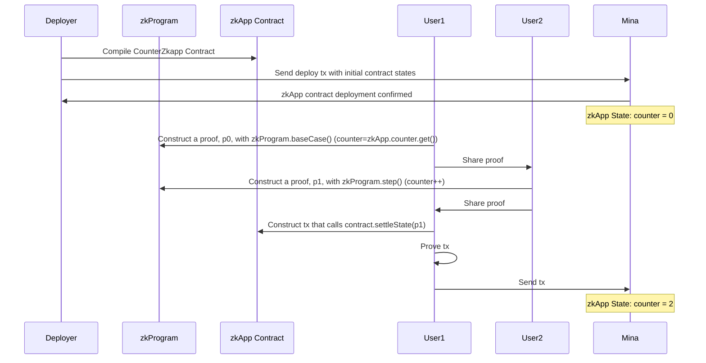

# Mina zkApp: Counter Zkapp Contract With Recursion

This project demonstrates how to build a simple zkApp with recursion in Mina Protocol, making use of Zero Knowledge Proofs (zk-SNARKs). We create a basic `AddOne` ZkProgram that recursively increments a state. This state is then settled in a `CounterZkApp` smart contract on-chain. 

This project, written in TypeScript, leverages the `snarkyjs` library. The implementation is similar to the `2-counter-contract-reducer` directory, but instead of using `Actions` with a `Reducer`, we accomplish everything off-chain. 

## Architecture

The project consists of two parts:

- A ZkProgram (in `./ZkProgram/RecursiveAddition.ts`)
  - It takes a `Struct` as a public input, called `RecursiveAdditionPublicInput` which has three properties `number`, `numberToAdd`, and `newState`. The `Struct` allows us to use more interesting data structures than only `Field` allows for!
  - The `RecursiveAdd` ZkProgram has a `init` method that defines the starting program values and a `add` method that verifies the correctness of the previous state and constrains what new state can be created. Note well that this recursive program has minimal constraints and anyone could use it! It is important to not only define what you constraints should allow for but also what they shouldn't allow for.

- A ZkApp smart contract (in `./ZkApp/AddOneZkApp.ts`)
  - It maintains a `counter` state.
  - It has a `settleState` method takes a `RecursiveAddition` proof that results from the ZkProgram and can settle the final recursive state in the smart contract.

Here's a sequence diagram for how I understand the process:



The interesting part is that these recursive program proofs can be exchanged between `User1` and `User2` as many times as they desire, or until some final state is reached! This opens up Mina to benefit from off-chain computation/proving that does not cause higher gas fees on the L1.

## Things to think about
Should we build a zkApp that works using a ZkProgram like the `RecursiveAdd` in this example, the user experience can be quite a challenge! For example, the proving time when running the `RunInteraction.js` script:
```sh
compiling RecursiveAddition zkProgram and zkApp... 73.757 sec
making proof 0... 570.915 sec
making proof 1... 455.099 sec
```
As a zkApp developer, this should direct our focus to consider who might be the user of this kind of zkApps, there are many interesting solutions and ideas in this area and I encourage any reader to delve into this topic! zkApps as roll-ups, or correctly, Validiums, may make a lot of sense here. Perhaps we can batch many transactions together, use a zkProgram to prove their state changes from `S_0 -> S_1 -> ... -> S_n`, and eventually settle that state on the zkApp contract at the L1.


## How to build

```sh
npm run build
```

## How to run the `RunInteraction.js` script
```sh
npm run build && node build/src/RunInteraction.js
```

## How to run tests

```sh
npm run test
npm run testw # watch mode
```

## How to run coverage

```sh
npm run coverage
```

## License

[Apache-2.0](LICENSE)
