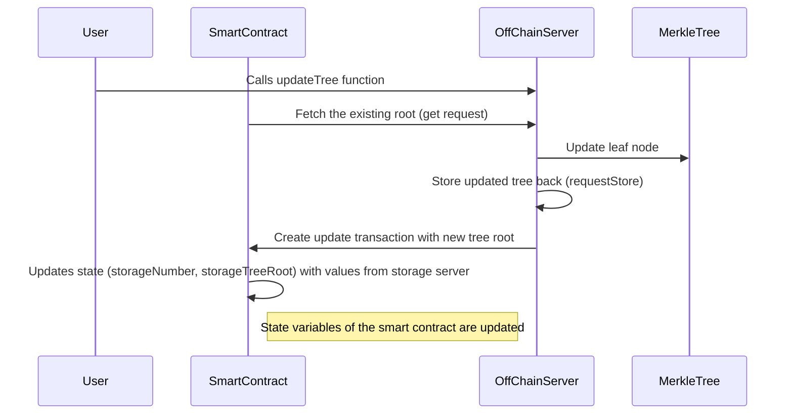

# Mina zkApp: Using Off-Chain Storage (with a local server)

This is an example of how off-chain storage can be used by a zkApp. Importantly, this is only a centralised, local-server implementation.

### Background
A *Merkle tree* is a binary tree where each node is the hash of its children, and the root node represents the "summary" of all other nodes in the tree. Merkle trees are really useful because they can be used to validate large sets of data efficiently. 

### What is going on in this example
Here, each leaf of the Merkle tree contains a single number (a `snarkyjs` `Field`), and the entire Merkle tree is stored off-chain on a storage server (run locally - see [How to build](#how-to-build)).

What causes the Merkle tree to update (i.e. mutate) is the use of the `updateTree` function (can be found in `./util/utils`). It is not only responsible for updating the Merkle tree's leaf but also communicating the changes to the smart contract. This is done by:

- Randomly picking a leaf index.
- Fetching the existing tree from the off-chain storage server.
- If the leaf at the selected index already exists, it increases its value by `3`; if it doesn't exist, the value is set to `1`.
- The updated leaf is stored back in the off-chain server.
- An update transaction is created and sent either locally or remotely, depending on the `useLocal` argument. The transaction updates the root of the Merkle tree in the smart contract with the new tree root.
- It then updates the `storageNumber` and `storageTreeRoot` states in the smart contract with the values obtained from the storage server.
- The contract code contains the logic for the update method, which updates the state variables of the smart contract.

We can imagine the `updateTree` function to be an abstraction of a wallet user requesting state changes to a particular Merkle lead that would cause an necessary update to the Merkle root, the Merkle root in this analogy could represent the entire zkApp state of many users! 

The `OffChainStorage` file provides several functionalities:

- `MerkleWitnessN`: Merkle tree witnesses for trees of various heights, where `N` is the height of the tree. A Merkle witness is used to verify the authenticity of a leaf in the Merkle tree.
- `assertRootUpdateValid`: Asserts that the proposed update to the tree's root is valid. It does so by checking that the proposed root update is correctly signed by the storage server, that the stored number is less than the new root number, and that the update process from the old root to the new one is valid.
- `get`: Retrieves the current state of the tree from the storage server.
requestStore: Asks the storage server to store the updated tree and returns the updated root number and its signature.
- `getPublicKey`: Retrieves the public key of the storage server.
- `makeRequest`: A helper function to make HTTP requests.
- `mapToTree`: Converts the data structure used to represent the tree from a Map to a Merkle tree.

## Architecture

The project consists of two parts:

- A zkApp (in `./ZkApp/NumberTreeContract.ts`)

- An Off Chain Server (in `./OffChainStorage/offChainServer.ts`)

Here's a diagram for how I understand the process:


## Other thoughts

How can we make the state-updates made to the L1 of varying size? Instead of updating the contract's state each time the Merkle tree is mutated, we can build a solution that makes state-updates to the L1 after `n` mutations where `n > 1`. Such an approach maximise utilisation of blockspace and not the amount of blockspace.

## How to build

```sh
npm run build
```

## How to run the `RunInteraction.js` script
First set up the local off-chain server:
```sh
npm run build && node build/src/OffChainStorage/offChainServer.js
```
Then in a separate terminal:
```sh
npm run build && node build/src/RunInteraction.js
```

## How to run tests

```sh
npm run test
npm run testw # watch mode
```

## How to run coverage

```sh
npm run coverage
```

## License

[Apache-2.0](LICENSE)
