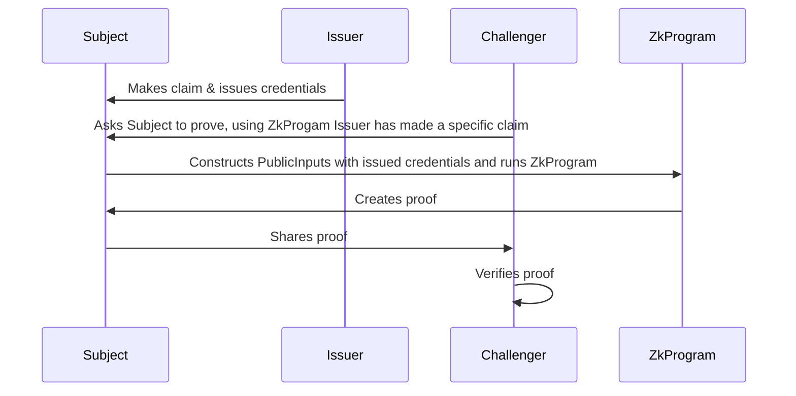

# Mina zkProgram: Challenge A User For Proof Of Credentials

This is a Typescript example of using a `snarkyjs` ZkProgram to prove that a subject has been issued credentials by an issuer and that they know of those credentials. The example in this repository uses a `kyc` property of a claim.

## Diagram of Interaction


## How to build

```sh
npm run build
```

## How to run the `RunInteraction.js` script
```sh
npm run build && node build/src/RunInteraction.js
```

## How to run tests

```sh
npm run test
npm run testw # watch mode
```

## How to run coverage

```sh
npm run coverage
```

## License

[Apache-2.0](LICENSE)
