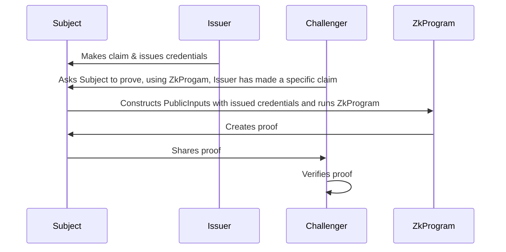

# Mina zkProgram: Challenge A User For Proof Of Credentials

This is a Typescript example of using a `snarkyjs` ZkProgram to prove that a subject has been issued credentials by an issuer and that they know of those credentials. The example in this repository uses a `kyc` property of a claim.

## Concept Overview

This program demonstrates a typical flow of issuing and verifying credentials:

1. The issuer creates a claim and issues credentials to the subject.
2. A challenger requests the subject to prove, using a ZkProgram, that the issuer has made a specific claim.
3. The subject uses the issued credentials to construct PublicInputs and runs the ZkProgram.
4. The ZkProgram creates a proof.
5. The subject shares the proof with the challenger.
6. The challenger verifies the proof.

## Diagram of Interaction

## Data Structures
This program primarily utilizes the following classes and structures:

`Claim`: A basic claim about a subject made by an issuer. It includes the subject's public key and a `kyc` field to represent the KYC status.
`SignedClaim`: This includes a claim along with a signature of the claim by the issuer.
`CredentialVerificationPrivateInput`: This represents a private input constructed by the subject about the claim. It consists of a signed claim and the subject's signature.
`PublicKeyIssuer`: This is the public key of the trusted issuer. It is hard coded for testing purposes.
`ProveCredential`: This is an instance of the `Experimental.ZkProgram` where the initialization (i.e., the `init` method) involves verification of the presentation and claim's authenticity.

## How to build

```sh
npm run build
```

## How to run the `RunInteraction.js` script
```sh
npm run build && node build/src/RunInteraction.js
```

## How to run tests

```sh
npm run test
npm run testw # watch mode
```

## How to run coverage

```sh
npm run coverage
```

## License

[Apache-2.0](LICENSE)
