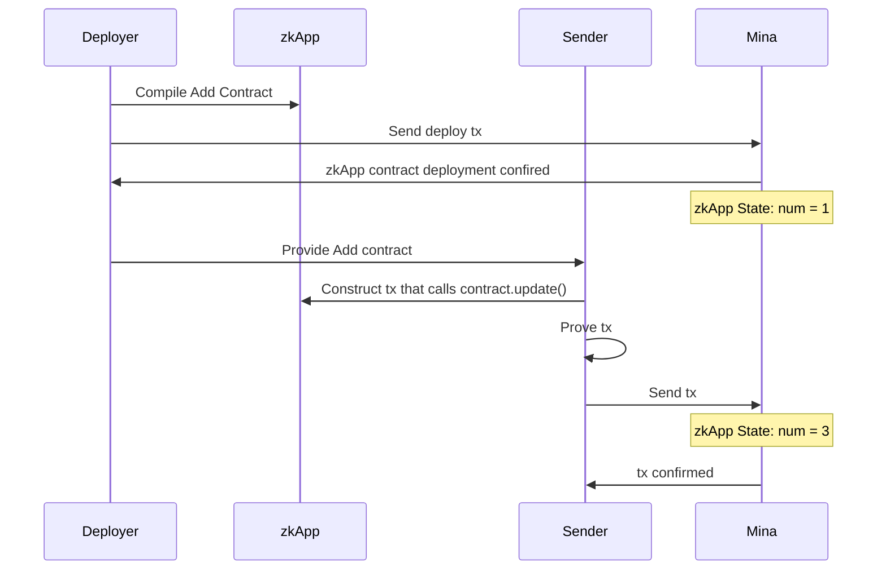

# Mina zkApp: Mina Add Contract

This project demonstrates the basic usage of zkApps in Mina Protocol by implementing a simple smart contract named `Add`. The `Add` contract holds a state variable `num`, which is a field initialized to `1` by default when the contract is deployed. Upon calling the `update` method, it adds `2` to the current `num` state.

The project is written in TypeScript and uses the `snarkyjs` library.

### Architecture

The project mainly consists of two parts:

- The Add Contract (`Add.ts`)
- Interaction Script (`interact.ts`)

The `Add` contract is a very basic smart contract example and the `interact.ts` script is used to interact with the `Add` contract by deploying and updating it.

Here is a basic diagram that outlines the interaction between the components:



## How to build

```sh
npm run build
```

## How to run tests

```sh
npm run test
npm run testw # watch mode
```

## How to run coverage

```sh
npm run coverage
```

## License

[Apache-2.0](LICENSE)
